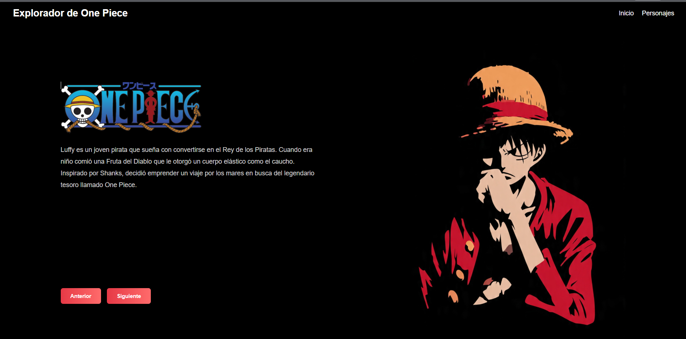
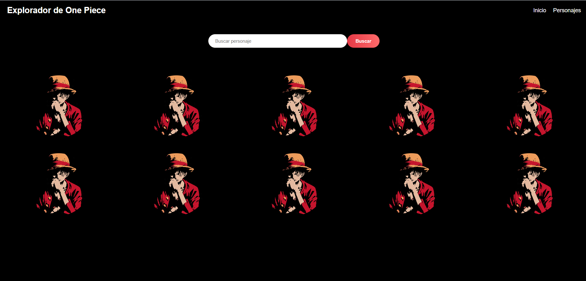
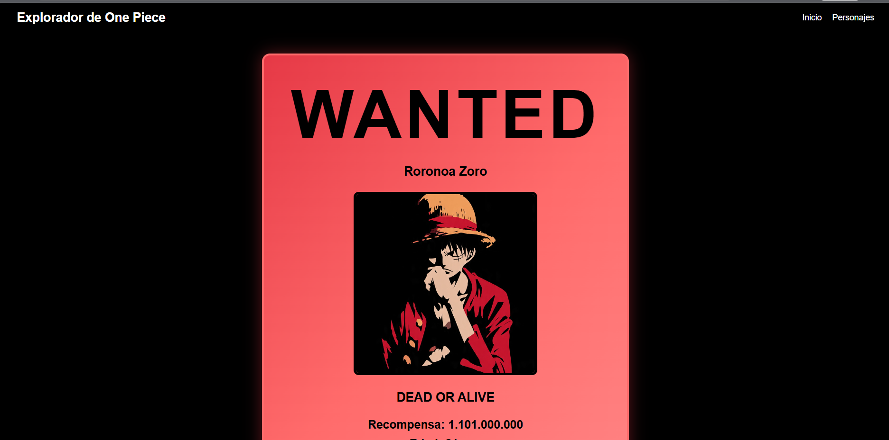

# Explorador de One Piece

## ¿Qué es este proyecto?

Este proyecto fue desarrollado utilizando HTML, CSS y JavaScript puro.

La aplicación permite explorar personajes del universo de One Piece utilizando una API pública. El usuario puede buscar personajes por nombre, visualizar una lista inicial de personajes y consultar información detallada de cada uno pero con una tarjeta de "WANTED".

El objetivo principal fue practicar el consumo de APIs, manipulación del DOM, eventos, async/await sin utilizar frameworks externos.

---

## API utilizada

API One Piece

https://api.api-onepiece.com/v2/characters/en

Documentación:

https://api.api-onepiece.com

---

## Funcionalidades

- Mostrar los primeros 10 personajes obtenidos desde la API.
- Buscar personajes por nombre.
- Filtrar personajes mientras se escribe.
- Mostrar información detallada de cada personaje.
- Navegar entre diferentes páginas del proyecto.
- Diseño adaptable para computadora, tablet y teléfono.

---

## Capturas de pantalla

### Página principal

<p align="center">
    
</p>

La página principal muestra una pequeña historia a qué es ONE PIECE.

---

### Página de personajes

<p align="center">
    
</p>

En esta sección se cargan los personajes obtenidos desde la API y se pueden buscar por nombre, simulando que hubieran sido más de 100 personajes, la barra de búsqueda permite encontrarlos rápidamente. 

---

### Página de detalle

<p align="center">
    
</p>

Al seleccionar un personaje se muestra información detallada como nombre, recompensa, edad, rol, estado y tripulación.

---

## ¿Cómo ejecutar el proyecto?

1. Descargar o clonar el repositorio.

2. Abrir la carpeta del proyecto.

3. Ejecutar un servidor local.

Por ejemplo, utilizando Live Server en Visual Studio Code.

4. Abrir el archivo:

```text
index.html
```

---

## Conceptos utilizados

Durante el desarrollo se utilizaron los siguientes temas vistos en clase:

- Fetch API
- Async / Await
- Promesas
- Eventos
- Manipulación del DOM
- createElement()
- appendChild()
- replaceChildren()
- addEventListener()
- Arrays
- filter()
- find()
- Responsive Design

---

## Observaciones

Las imágenes de los personajes fueron agregadas manualmente para representar visualmente los resultados obtenidos desde la API, ya que la API utilizada no proporciona imágenes de los personajes.

### Autor

Stefanny Estevez